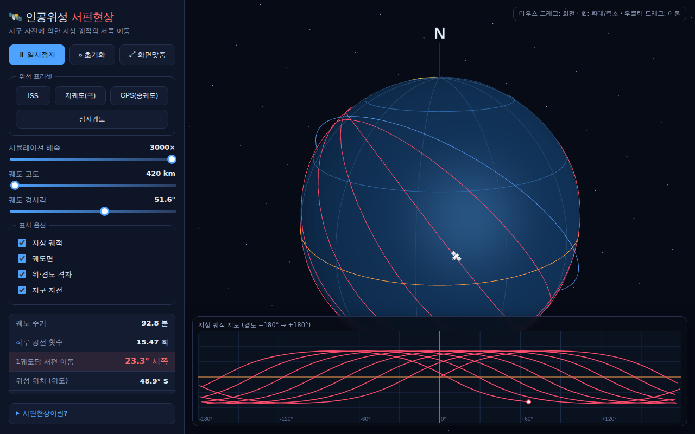

# 🛰️ 인공위성 서편현상 3D 뷰어

지구가 자전하기 때문에 인공위성의 **지상 궤적(ground track)이 궤도를 돌 때마다
서쪽으로 밀려나는** 현상(**서편현상**)을 3D 지구본과 2D 지도로 함께 보여주는
교육용 시뮬레이터입니다. 수업 시간에 학생들에게 그대로 나눠주고 브라우저에서
바로 열어 사용할 수 있습니다.



## 학습 목표

- 인공위성의 궤도면은 **우주(관성계)에 고정**되어 있고, 그 안에서 **지구가
  서→동으로 자전**한다는 것을 시각적으로 이해한다.
- 위성이 한 바퀴 도는 동안 지구가 동쪽으로 돌아, 다음 지상 궤적이 앞 궤도보다
  **서쪽으로 밀려나는** 이유를 설명한다.
- **1궤도당 서편 이동량 = 360° × (궤도 주기 ÷ 항성일)** 공식을 값으로 확인한다.
- 고도를 **정지궤도(약 35,786 km)** 로 올리면 서편 이동이 **0** 이 되어 위성이
  한 지점 위에 멈춰 보이는 이유를 관찰한다.

## 실행 방법

인터넷 연결 없이도 동작하도록 필요한 라이브러리(Three.js)를 저장소에 포함해
두었습니다(`vendor/`). 다만 브라우저 보안 정책상 `index.html`을 파일로 바로
열면 모듈이 차단될 수 있으므로, **간단한 로컬 서버**로 여는 것을 권장합니다.

```bash
# 방법 1) Python (대부분의 PC에 설치되어 있음)
python3 -m http.server 8000
#  → 브라우저에서 http://localhost:8000 접속

# 방법 2) Node.js
npx serve .
```

> 학생 배포용으로는 이 폴더 전체(`index.html`, `css/`, `js/`, `vendor/`)를
> 압축해 나눠주거나, GitHub Pages·학교 홈페이지 등 정적 호스팅에 올려
> 링크만 공유해도 됩니다.

## 사용법

| 조작 | 설명 |
|------|------|
| 마우스 드래그 | 지구본 회전 |
| 마우스 휠 | 확대 / 축소 |
| 우클릭 드래그 | 화면 이동 |
| **위성 프리셋** | ISS · 저궤도(극궤도) · GPS(중궤도) · 정지궤도 한 번에 설정 |
| **시뮬레이션 배속** | 실제 90여 분 걸리는 궤도를 빠르게 재생 |
| **궤도 고도 / 경사각** | 슬라이더로 자유롭게 바꾸며 서편 이동량 변화 관찰 |
| **표시 옵션** | 지상 궤적 · 궤도면 · 위경도 격자 · 지구 자전 켜고 끄기 |

### 추천 수업 시연

1. **ISS(고도 420 km)** 프리셋으로 시작 → 2D 지도에서 궤적이 왼쪽(서쪽)으로
   계단처럼 밀리는 모습을 관찰합니다. (1궤도당 약 23° 서편)
2. **「지구 자전」 체크를 해제** → 궤적이 더 이상 서쪽으로 밀리지 않고 한 자리에
   겹칩니다. "서편의 원인은 지구 자전"임을 즉시 확인시킬 수 있습니다.
3. **정지궤도** 프리셋 → 주기가 항성일과 같아져 서편 이동이 **0**, 위성이 한
   지점 위에 멈춥니다.
4. 고도 슬라이더를 천천히 올리며 **「1궤도당 서편 이동」** 값이 어떻게
   변하는지 학생들이 예측·확인하게 합니다.

## 물리 모델

- 지구 반경 `R = 6371 km`, 표준중력상수 `μ = 398600.4418 km³/s²`,
  항성일 `86164 s`.
- 원궤도 가정: 반경 `a = R + 고도`, 주기 `T = 2π√(a³/μ)`.
- 서편 이동량 `Δλ = 360° × (T / 86164)` — 위성이 한 바퀴 도는 동안 지구가
  동쪽으로 회전한 각도만큼 지상 궤적이 서쪽으로 이동합니다.
- 좌표계: 장면 = 관성계(ECI), Y축 = 지구 자전축. 위성은 관성계에서 궤도를 돌고,
  지구 그룹만 Y축 둘레로 자전합니다. 지상 궤적은 지구에 붙어 함께 회전합니다.

> 세차운동(J2), 궤도 이심률, 대기 저항 등은 교육적 단순화를 위해 생략했습니다.

## 파일 구성

```
index.html            뷰어 화면(레이아웃·컨트롤)
css/style.css         스타일
js/app.js             시뮬레이션 & 렌더링 (Three.js)
vendor/               Three.js 라이브러리 (오프라인 포함)
```

## 라이선스

[Three.js](https://threejs.org/) 는 MIT 라이선스로 배포됩니다
(`vendor/` 포함). 그 외 코드는 수업·교육 목적으로 자유롭게 사용하세요.
